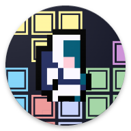

Note: README.md is under construction.

# Compose Tetris

English | [中文介绍](https://github.com/vitaviva/compose-tetris/blob/master/README_zh.md)


## :scroll: Description

A tetris game fully built using [Jetpack Compose](https://developer.android.com/jetpack/compose),
almost all UI elements are created by code, including the following app icon, which is also
generated by Composable with @Preview.




- MVI architecture
- Simulate appearance of LCD screen
- Game sound and clock
- Inspired by [react-tetris](https://github.com/chvin/react-tetris/blob/master/README-EN.md)

#### Game Rules：

- 100 points for 1 line, 300 points for 2 lines, 700 points for 3 lines, 1500 points for 4 lines;
- The drop speed of the box increases with the number of rows eliminated (one level for every 20
  lines);

<br/>

## :nut_and_bolt: MVI Architecture:


<br/>

## :camera_flash: Screenshots


# Attribution


### App Icon

https://trevor-pupkin.itch.io/outer-buddies

```
LICENCE: This asset pack can be used in both free and commercial projects. You can modify it to suit your own needs.
```

### Background Art

https://hexadecimalwtf.itch.io/space-pixels

```
Hi Everyone!,

Feel free to use this in any project you want. No credit is necessary. If you do use these assets for your project I would be happy to see them in use! Feel free with add a comment with a link.

-Hex
```

https://norma-2d.itch.io/celestial-objects-pixel-art-pack

```
LICENSE: You can use this asset pack both in free and commercial projects. You may modify it to suit your own needs. Credit is not necessary, but appreciated.

You may not redistribute or resell the assets/ the asset pack!
```

### BGM

https://opengameart.org/content/another-space-background-track

CC0 1.0 Universal (CC0 1.0) Public Domain Dedication

### SFX

https://opengameart.org/content/63-digital-sound-effects-lasers-phasers-space-etc

CC0 1.0 Universal (CC0 1.0) Public Domain Dedication

```
Digital SFX set by Kenney Vleugels (www.kenney.nl)

You may use these sounds in personal and commercial projects. Credit (www.kenney.nl) would be nice
but is not mandatory.
```

### Source Code

```
MIT License

Copyright (c) 2021 fundroid

Permission is hereby granted, free of charge, to any person obtaining a copy
of this software and associated documentation files (the "Software"), to deal
in the Software without restriction, including without limitation the rights
to use, copy, modify, merge, publish, distribute, sublicense, and/or sell
copies of the Software, and to permit persons to whom the Software is
furnished to do so, subject to the following conditions:

The above copyright notice and this permission notice shall be included in all
copies or substantial portions of the Software.

THE SOFTWARE IS PROVIDED "AS IS", WITHOUT WARRANTY OF ANY KIND, EXPRESS OR
IMPLIED, INCLUDING BUT NOT LIMITED TO THE WARRANTIES OF MERCHANTABILITY,
FITNESS FOR A PARTICULAR PURPOSE AND NONINFRINGEMENT. IN NO EVENT SHALL THE
AUTHORS OR COPYRIGHT HOLDERS BE LIABLE FOR ANY CLAIM, DAMAGES OR OTHER
LIABILITY, WHETHER IN AN ACTION OF CONTRACT, TORT OR OTHERWISE, ARISING FROM,
OUT OF OR IN CONNECTION WITH THE SOFTWARE OR THE USE OR OTHER DEALINGS IN THE
SOFTWARE.
```
